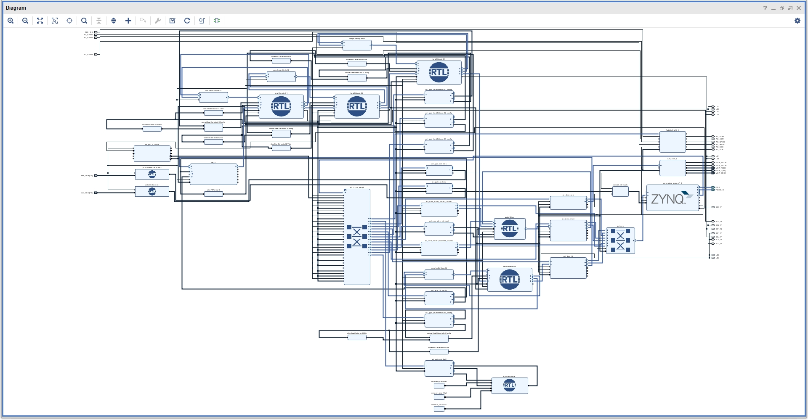

# ENSC 452 - Group 15 - The Ultimate DJ Board

## Overview
This is our group project for ENSC 452 - Advanced Digital System Design.  We decided to do audio processing in the form of a DJ board.

### IP Cores Used
* AXI-Stream FFT (512 point)
* AXI GPIO
* AXI DMA
* [AXI Audio Controller](https://github.com/Laxer3a/ZedBoardAudio)
* AXI-Stream VGA Core (see acknowledgements)
* Beat Detector (Custom)
* Audio Mixer (Custom)

## Features
* Play stored sounds (Airhorn and DJ Khaled's Another One)
* Equalizer effects for high, mid, and low frequencies.
* Echo effect.
* Record and playback Line In audio.
* Loopback recorded audio.

## Requirements
* ZedBoard
* Vivado 2017.3
* Vivado 2017.3 Tcl Shell
* Xilinx SDK

## Usage

### Vivado
1. Open Vivado.
2. Run `build.tcl`.  This will generate the block diagram.
3. Click `Generate Bitstream`.  This will take a while, so grab yourself a coffee and get comfortable!
4. Export the hardware.
5. Launch the SDK with default settings.

### Xilinx SDK
1. Import projects from `./sdk`.  Do not select the `*_bsp` and `audioTest_wrapper_*` projects.
2. Create a board support package (BSP) with the name `audioTest_bsp` and the following setting:  
   Uncheck **Use default location**.  
   Location: **(browse to `sdk` folder)**  
   CPU: **ps7_cortexa9_0**.
3. Create a board support package (BSP) with the name `vga_bsp` and the following setting:  
   Uncheck **Use default location**.  
   Location: **(browse to `sdk` folder)**  
   CPU: **ps7_cortexa9_1**.
2. Build the project.
3. Program the FPGA with the bitstream that you exported.

### Set Up Debug Configurations
Make two debug configurations with the following names:

1. **Run Me First!**  
   In the `Target Setup` tab:  
   Debug Type: **Standalone Application Debug**.  
   Uncheck **Program FPGA**.  
   Check **Run ps7\_post\_config**.  
   In the `Application` tab:  
   Core 0: **audioTest/audioTest.elf**  
   Core 1: **(none)**
2. **Run Me Second!**  
   In the `Target Setup` tab:  
   Debug Type: Standalone Application Debug.  
   Uncheck **Program FPGA**.  
   Check **Run ps7\_post\_config**.  
   In the `Application` tab:  
   Core 0: **audioTest/audioTest.elf**  
   Core 1: **vga/vga.elf**

### Run Project
1. Ensure that **Skip All Breakpoints** is deselected.
2. Debug `Run Me First!`, and click **Continue** when loaded.
3. Debug `Run Me Second!`.  If a prompt pops up regarding `Run Me First!`, click **Yes** to terminate it and continue.

### Load Files onto DDR3
1. Open the Vivado 2017.3 Tcl Shell.
2. In `./ddr`, modify the TCL script to point to the absolute path of the `ddr` folder.
3. Copy and paste the script into the shell.
4. Verify that the shell has loaded all files onto the board.

### Playing With The Board Features.
1. In the SDK, click **Continue** on core 0 (important!).
2. Click **Continue** on core 1.
3. Plug in your audio source into **Line In**.
4. Plug in your headphones/speakers into **Headphone Out**.
5. Go and have fun!

### Load onto SD Card (Optional)
1. In the SDK, click File > New > Application Project.
2. Choose any name for your application project.
3. For the Hardware Platform, choose **audioTest_wrapper_***, and click **Next**.
4. Select **Zynq FSBL**, and click **Finish**.  This is your bootloader.
5. Build all projects.
6. Click Xilinx > Create Boot Image.
7. Specify an output path with the filename as `BOOT.bin`
7. Add the following files **in order**:
   - bootloader `.elf` with **Partition Type** `bootloader`.
   - bitstream `.bit` with **Partition Type** `data`.
   - audioTest `.elf` with **Partition Type** `data`.
   - anotherOne `.bin` with **Partition Type** `data` and with **Load** set to the address in `luiMemoryLocations.h`.
   - airhorn `.bin` with **Partition Type** `data` and with **Load** set to the address in `luiMemoryLocations.h`.
8. Click **Create Image**.
9. Copy `BOOT.bin` to the root of a FAT32 formatted SD card, and insert it into the ZedBoard.
10. Set the boot mode of the ZedBoard to SD Card by shorting jumpers MIO4 and MIO5.
11. Turn it on, and have fun!

## Button Mappings
### Equalizer: 

- Switch 0: Adjust low frequencies (Down - off, Up - on)  
- Switch 1: Adjust mid frequencies (Down - off, Up - on)  
- Switch 2: Adjust high frequencies (Down - off, Up - on)  

### Pitch and Echo:
- **Switch 3:** Enable pitch adjustment with push buttons (not working) (Down - off, Up - on)
- **Switch 4:** Enable echo adjustment with push buttons (Down - off, Up - on).
- **PL Push Button Up:** Amplify the enabled effects from switch 3 and 4.
- **PL Push Button Centre:** Reset the enabled effects from switch 3 and 4 to their default (off) values.
- **PL Push Button Down:** Lower the enabled effects from switch 3 and 4.

### Recorded and Stored Sounds:
The following two push buttons depend on the settings on switches 7 to 5.

- **PS Push Button Right:** Playback sound to Headphone Out.
- **PS Push Button Left:** Record sound from Line In.

| Setting                                       | Switch 7  | Switch 6  | Switch 5  |  
| --------------------------------------------- |:---------:|:---------:|:---------:|  
| Use/record recorded sound 1 (no loopback)     | Down      | Down      | Down      |  
| Use/record recorded sound 1 (loopback)        | Up        | Down      | Down      |  
| Use/record recorded sound 2 (no loopback)     | Down      | Up        | Up        |  
| Use/record recorded sound 2 (loopback)        | Up        | Up        | Up        |  
| Use stored sound 1 (Another One)              | Down      | Up        | Down      |  
| Use stored sound 1 (Airhorn)                  | Down      | Down      | Up        |  

## Acknowledgements
- Kind thanks to our classmates Maggie Parkhurst and Steven Lippmann for lending us their VGA core.
- AXI-Lite Slave from [Laxer3a](https://github.com/Laxer3a/ZedBoardAudio)
- Circular buffer for echo effect from [EmbeddedArtistry](https://github.com/embeddedartistry/embedded-resources/blob/master/examples/c/circular_buffer.c)